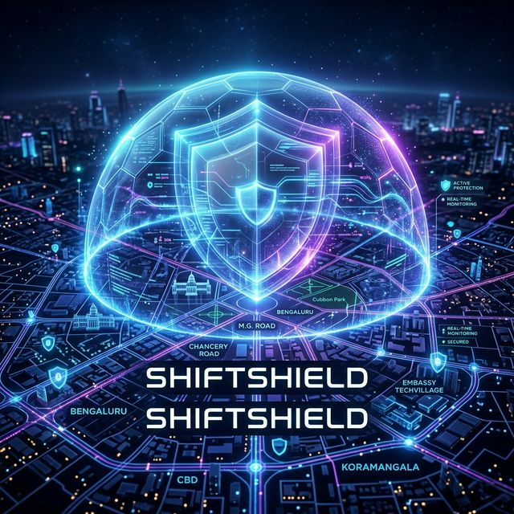
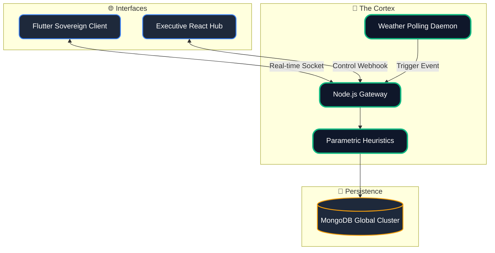
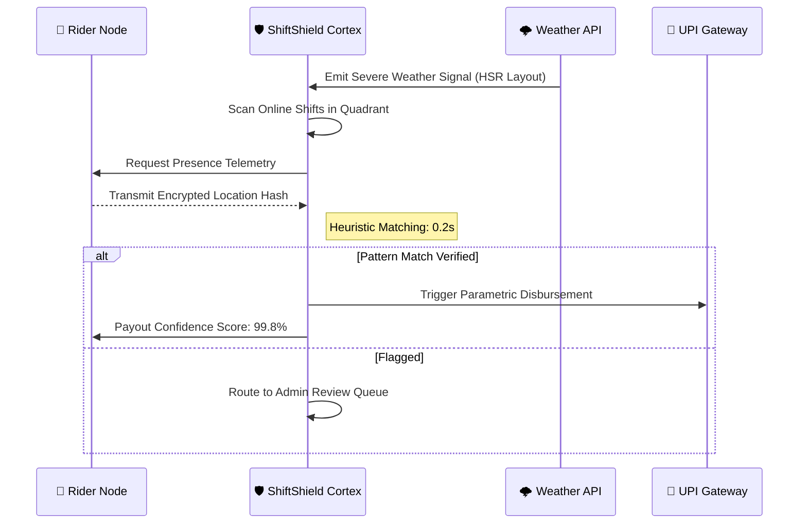

<div align="center">



<br/>

<a href="https://flutter.dev"></a>
<a href="https://nodejs.org"></a>
<a href="https://reactjs.org/"></a>
<a href="https://socket.io/"></a>
<a href="https://www.mongodb.com/"></a>

<h1>🛡️ ShiftShield: The Parametric Sovereign</h1>

**World-Class Autonomous Protection for the Gig Economy**

<p align="center">
  
</p>

</div>

---

## ⚡ The Sovereign Philosophy

ShiftShield is the world's first **Parametric Sovereign**. We don't just provide insurance; we provide **certainty**. When a storm hits, our Cortex Engine doesn't wait for a human to review a claim. It match-checks weather telemetry against rider GPS vectors and triggers a disbursement in **sub-600ms**.

---

## 🏗️ Technical Architecture: The Triad



---

## 🛡️ Fraud Guard Lifecycle

Ensuring integrity without sacrificing velocity.



---

## 🚀 Deployment Guide

```bash
# Clone and Initialize
git clone https://github.com/Gokulk1018/AI-Gig-Insurance-Platform.git
cd ShiftShield

# Start Server
cd apps/api-server && npm install && npm run dev

# Launch Executive Hub
cd apps/admin-web && npm install && npm run dev

# Deploy Rider Node
cd apps/rider_app && flutter run -d chrome
```

<div align="center">
  <br/>
  
  <i>"Shielding the workers that power the future." 🛡️</i>
</div>
