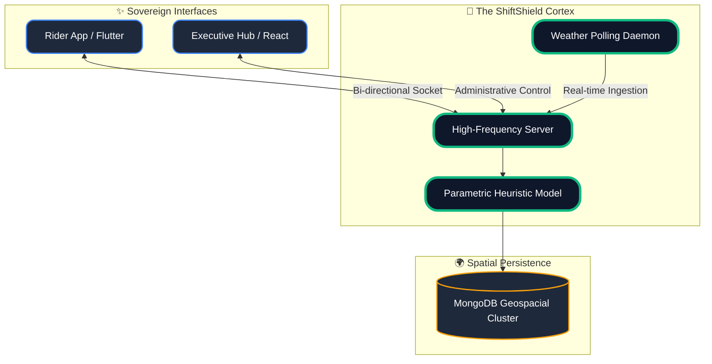

<div align="center">


<br/>

<div style="display: flex; justify-content: center; gap: 10px; margin-top: 20px;">
  <a href="https://flutter.dev"></a>
  <a href="https://nodejs.org"></a>
  <a href="https://reactjs.org/"></a>
  <a href="https://socket.io/"></a>
</div>

<br/>

<h1 style="font-family: 'Orbitron', sans-serif; letter-spacing: 5px; background: linear-gradient(90deg, #3b82f6, #10b981); -webkit-background-clip: text; -webkit-text-fill-color: transparent;">SHIFT SHIELD CORE</h1>

**The World's First Parametric Sovereign for the Global Gig Fleet**

<p align="center">
  
</p>

</div>

---

## 🔱 The Sovereign Philosophy

ShiftShield isn't just an application—it's a **Parametric Protocol**. We've eliminated the human friction from the insurance lifecycle. By fusing real-time weather telemetry with persistent GPS vectors, we achieve **Automated Trust**. 

> [!IMPORTANT]
> **Sub-600ms Velocity**: From disruption detection to bank-ready disbursement. No claims forms. No adjusters. No delays.

---

## 🏗️ Technical Architecture 2.0



---

## 🛡️ Autonomous Fraud Guard

Our multi-layered heuristic stack ensures parametric integrity at scale.

| Layer | Technology | Function |
| :--- | :--- | :--- |
| **L1: Presence** | GPS / Geofencing | Verifies physical exposure to disruption zone |
| **L2: Velocity** | Subscription Tracking | Prevents cap-skimming and account farming |
| **L3: Pattern** | Disruption Match | Cross-references telemetry with rider shift status |

---

## 🚀 Rapid Deployment

```bash
# Clone the Core
git clone https://github.com/Gokulk1018/AI-Gig-Insurance-Platform.git

# Ignite the Cortex (Backend)
cd apps/api-server && npm i && npm run dev

# Launch Executive Hub (Frontend)
cd apps/admin-web && npm i && npm run dev

# Deploy Rider Edge (Mobile)
cd apps/rider_app && flutter run -d chrome
```

---

<div align="center">
  <br/>
  
  <i>"Redefining protection for the digital worker." 🛡️</i>
</div>
